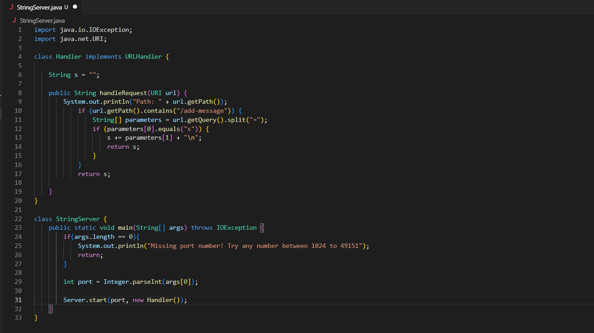
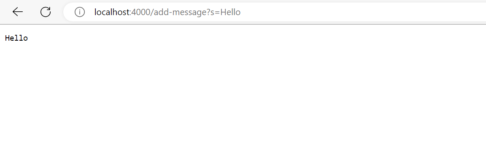
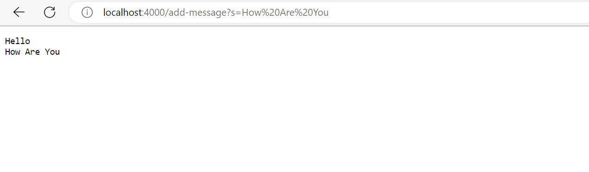
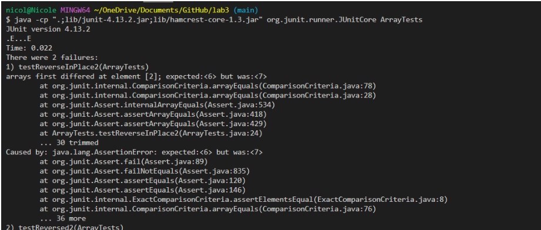

Lab Report 2
============
This lab will show you what I learned about Servers and Bugs in the last two weeks.

**Part 1**
---

I created a new websever called StringServer. I did this by creating a new file in the lab 2 wavelet folder that we cloned. I copied the code from the NumberServer file and made some adjustments to supports the path and behavior that StringServer needed. It should keep track of a single string that gets added to by incoming requests made by adding to the url of the of the server a path of the following format: `/add-message?s=<string>`.

This is the code that I used to create StringServer:


To implement this, first I created a string `s` that had nothing stored. I then used the method `url.getPath().contains("/add-message")` to see if the URL contains the `add-message` query. This works because the `getPath()` method is supposed to get the path of the server and the `contains()` checks if the queue is contained in the path.

After checking that it contains `add-message` query, I made an array called parameters that splits the query with the `=`. I used the method `url.getQuery().split("=")` to achieve this. This works because `getQuery()` works similar to `getPath()` but it only gets the query part of the path, which would be 
`s=<string>`. The `split()` method then splits the query into two parts, one is `s` and the other is `<string>`. These two parts are stored in different indexes in the array. 

Then I checked if the element at the first index is `s`, which is should be if the query is implemented correctly. Then I update the string `s` created in the very beginning to concatenant the message that should be added, so I concatenated the second part of the query which is the `string` and also the new line `\n` so that any other queries will be shown in a seperate line. 

At the last step, I return the new string `s` so that it would be shown on the live server. 

Here is an example of me trying to add `Hello` to the server by adding `/add-message?s=Hello` to the url:



Going through the code again with this `/add-message?s=Hello` added to the url, I first created a string `s` that had nothing stored. I then used the method `url.getPath().contains("/add-message")` to see if the URL contains the `add-message` query. Seeing that it does contains `add-message` query, I made an array called parameters that splits the query with the `=` using `url.getQuery().split("=")`. So the parameters array should have `s` at index 0 and `Hello` at index 1. Then I checked if the element at the index 0 is `s`, which is true. Then I update the string `s` to  concatenant `Hello`, then adding new line `\n` so the new string `s` would be `Hello\n`. Then, I returned the new string `s` so that it would be shown on the live server as Hello.

Now I am trying to add another message onto the server by adding `/add-message?s=How%Are%You` to the url:



Addind `/add-message?s=How%Are%You` will go thorugh the exact same steps as adding `/add-message?s=Hello` to the url, so I will not repeat myself again with the entire process. However, I will point out a slight difference between these two which causes both of the messages to appear on the server. This is because from before by adding `/add-message?s=Hello` to the url, we noted that the string `s` would be `Hello\n`. So at the start, instead of being empty, the string `s` would be `Hello\n`. This means that when we concatenate `How%Are%You` and `\n` the string s would be `Hello\nHow%Are%You\n`, which is why the server shows both `Hello` and `How Are You`.

**Part 2**
---
I am going to be addressing the bug in the reverseInPlace() method from lab 3.

Here is a failure inducing test that I tried for this buggy program. 
 ```@Test
  public void testReverseInPlace2(){
    int[] input2 = {5,6,7,8};
    int[] input3 = {8,7,6,5};
    ArrayExamples.reverseInPlace(input2);
    assertArrayEquals(input3, input2);
  }
 ```
This is a test given that does not induce a failure: 

``` @Test 
  public void testReverseInPlace() {
    int[] input1 = { 3 };
    ArrayExamples.reverseInPlace(input1);
    assertArrayEquals(new int[]{ 3 }, input1);
	}
```

This is the symptom of the code:


This is the code from before I fixed the program: 

```static void reverseInPlace(int[] arr) {
    for(int i = 0; i < arr.length; i += 1) {
      arr[i] = arr[arr.length - i - 1];
    }
  } 
```

The reason why this doesn't work is because the reverseInPlace method switches the elements around in the array but it changes the first half of the elements before changing the second half of the elements so the second half remains the same. 

This is the code of the program after I addressed the bugs:

```static void reverseInPlace(int[] arr) {
    for(int i = 0; i < arr.length/2; i += 1) {
      int temp = arr[i];
      arr[i] = arr[arr.length - i - 1];
      arr[arr.length-i-1] = temp;
    }
  }
```
  
For the reverseInPlace method I made the for loop stop at half the length of the array, and I made a temp variable that will store the element before it gets changed. Then I changed the second half of the array at the specific index to be the temp value. This addresses the issue because the first half of the elements will not get replaced by the back half before we store the values of the first half of the array. Now, the first and last elemnt of the array will be changed at the same time with the help of the temp variable.

**Part 3**
---
In the lab in week 2, I think I learned a lot of new things about servers and how I can write code that can implement the changes I want by changing the path of the url. I didn't know how easy it could be to deploy a server and make changes to it before so it was super cool learning how to change the URL of the server and get different results on the page by the changes made from the URL. I learned how to breakdown the path into different parts and find the query to implement the requests that I want to make by the changes I made to the URL. Overall, I think I really enjoyed the lab about servers and I think I learned a lot of new information that will be useful for me in the future.
